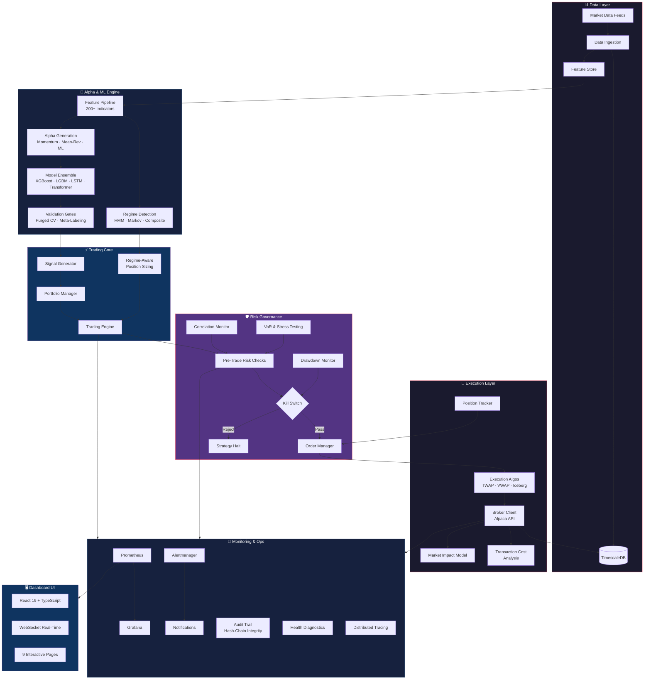
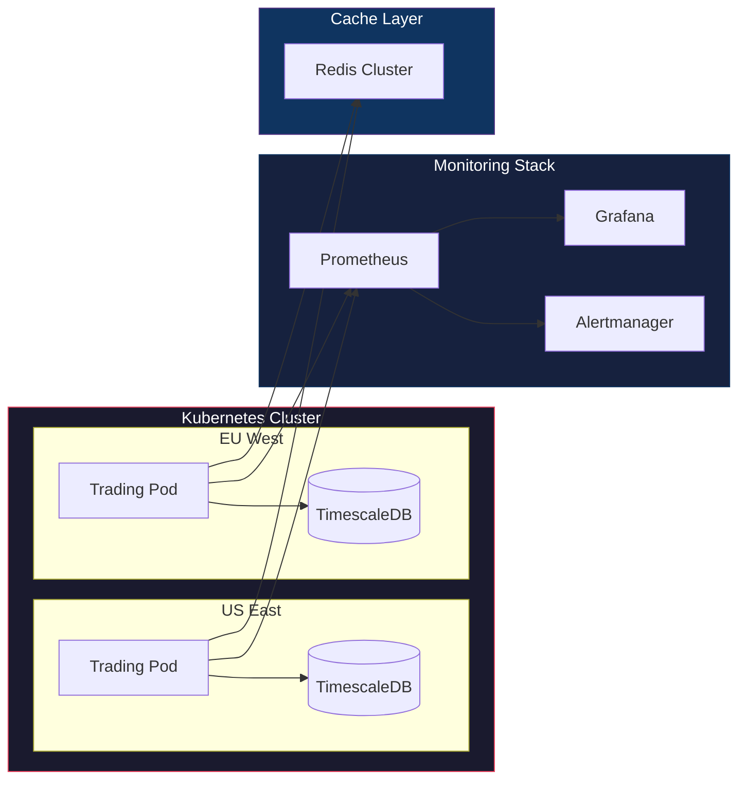

<p align="center">
  
  
  
  
  
  
  
  
</p>

<h1 align="center">⚡ AlphaTrade System</h1>

<p align="center">
  <strong>Institutional-Grade Quantitative Trading Platform</strong><br/>
  <em>End-to-end algorithmic trading infrastructure — from raw market data to execution, with ML/DL-driven alpha generation, institutional risk controls, and real-time monitoring.</em>
</p>

<p align="center">
  <code>110+ Python Modules</code> · <code>~80,000 Lines of Backend Code</code> · <code>12 Domain Subpackages</code> · <code>React 19 Dashboard</code> · <code>Full Docker/K8s Stack</code>
</p>

---

## Table of Contents

- [Why This Project](#why-this-project)
- [System Architecture](#system-architecture)
- [Core Modules Deep Dive](#core-modules-deep-dive)
  - [Alpha Generation Engine](#1-alpha-generation-engine-alpha)
  - [Feature Engineering Pipeline](#2-feature-engineering-pipeline-features)
  - [Model Lifecycle Manager](#3-model-lifecycle-manager-models)
  - [Risk Governance Framework](#4-risk-governance-framework-risk)
  - [Execution Intelligence Layer](#5-execution-intelligence-layer-execution)
  - [Trading Orchestration](#6-trading-orchestration-trading)
  - [Backtesting & Research](#7-backtesting--research-backtest)
  - [Data Fabric](#8-data-fabric-data)
  - [Core Infrastructure](#9-core-infrastructure-core)
  - [Monitoring & Observability](#10-monitoring--observability-monitoring)
  - [Database & Persistence](#11-database--persistence-database)
  - [Configuration Management](#12-configuration-management-config)
- [Real-Time Dashboard](#real-time-dashboard)
- [Infrastructure & DevOps](#infrastructure--devops)
- [Technology Stack](#technology-stack)
- [Unified CLI Surface](#unified-cli-surface)
- [Data Universe](#data-universe)
- [Testing & Quality](#testing--quality)
- [Reviewer Fast-Track](#reviewer-fast-track)
- [Getting Started](#getting-started)

---

## Why This Project

This is not a tutorial project, a Jupyter notebook demo, or a toy strategy backtester.

**AlphaTrade** is a production-designed, full-stack quantitative trading system that mirrors the architecture of institutional trading desks. It was built from scratch to demonstrate deep expertise across:

| Domain | What It Proves |
|--------|---------------|
| **System Design** | Event-driven, domain-driven modular architecture with CQRS, circuit breakers, and lazy-loading |
| **Financial ML/DL** | Leakage-aware pipelines (purged CV, embargo), model governance, ensemble learning, reinforcement learning |
| **Risk Engineering** | Pre-trade checks, kill switch, drawdown protection, VaR/stress testing, correlation monitoring |
| **Execution Quality** | Smart order routing, TWAP/VWAP algos, market impact modeling, transaction cost analysis |
| **Observability** | Prometheus metrics, Grafana dashboards, structured logging, distributed tracing, tamper-evident audit |
| **Infrastructure** | Docker Compose, Kubernetes multi-region, TimescaleDB, Redis, CI/CD pipeline readiness |
| **Full-Stack** | React 19 + TypeScript real-time dashboard with WebSocket feeds, Zustand state management, Framer Motion |

---

## System Architecture



---

## Core Modules Deep Dive

### 1. Alpha Generation Engine (`alpha/`)

The signal discovery layer implementing multiple alpha strategy families with dynamic combination.

| Module | Lines | Purpose |
|--------|-------|---------|
| `alpha_base.py` | ~700 | Abstract alpha interface, lifecycle management, signal normalization |
| `momentum_alphas.py` | ~600 | Cross-sectional & time-series momentum, breakout detection |
| `mean_reversion_alphas.py` | ~650 | Statistical arbitrage signals, Ornstein-Uhlenbeck, z-score reversals |
| `ml_alphas.py` | ~640 | ML-driven alpha factors, feature importance-weighted signals |
| `alpha_combiner.py` | ~1,100 | Weighted alpha blending, regime-conditional mixing, turnover control |
| `alpha_metrics.py` | ~960 | IC/IR analysis, decay profiling, alpha orthogonality testing |
| `regime_detection.py` | ~1,350 | HMM-based regime classification, Markov switching, composite detector |

**Key Design Decisions:**
- Alpha signals are **regime-conditioned** — the combiner dynamically reweights alphas based on detected market regime (trending, mean-reverting, volatile, calm)
- Built-in **alpha decay analysis** tracks signal half-life to prevent stale signal usage
- All alphas implement a common interface enabling hot-swappable strategy modules

---

### 2. Feature Engineering Pipeline (`features/`)

Production feature computation with 200+ indicators across multiple feature categories, with GPU acceleration support.

| Module | Lines | Purpose |
|--------|-------|---------|
| `technical.py` | ~2,000 | Complete technical indicator suite (RSI, MACD, Bollinger, Ichimoku, etc.) |
| `technical_extended.py` | ~1,500 | Advanced indicators (Heikin-Ashi, Renko, Keltner, Donchian, etc.) |
| `statistical.py` | ~1,250 | Returns distributions, rolling volatility, VaR, Hurst exponent, entropy |
| `microstructure.py` | ~1,450 | Bid-ask bounce, Kyle lambda, volume clock, order flow toxicity (VPIN) |
| `cross_sectional.py` | ~1,000 | Relative strength, sector momentum, dispersion, rank-based features |
| `feature_pipeline.py` | ~1,250 | Orchestration, caching, dependency graph, parallel computation |
| `optimized_pipeline.py` | ~1,050 | RAPIDS/cuDF GPU acceleration, Numba JIT fallback, memory optimization |

**Key Design Decisions:**
- Feature pipeline uses a **DAG-based dependency graph** to compute features in optimal order
- Supports **GPU-accelerated computation** via RAPIDS cuDF with automatic CPU fallback
- **Feature quality gates** prevent downstream usage of features with excessive NaN rates or zero variance

---

### 3. Model Lifecycle Manager (`models/`)

Institutional-grade ML/DL model management — from training through validation to deployment governance.

| Module | Lines | Purpose |
|--------|-------|---------|
| `classical_ml.py` | ~1,050 | XGBoost, LightGBM, CatBoost, Random Forest, ElasticNet wrappers |
| `deep_learning.py` | ~1,700 | LSTM, Transformer, TCN architectures with PyTorch Lightning |
| `reinforcement.py` | ~1,250 | PPO-based RL agent for adaptive position sizing |
| `rl_meta_learning.py` | ~870 | Meta-learning across market regimes, few-shot adaptation |
| `ensemble.py` | ~970 | Voting, Stacking, Adaptive ensemble with regime-aware weighting |
| `meta_labeling.py` | ~690 | Marcos López de Prado's meta-labeling for bet sizing |
| `purged_cv.py` | ~1,030 | Purged K-Fold, Embargo, Combinatorial Purged CV |
| `validation_gates.py` | ~500 | Multi-gate validation (performance, stability, overfitting, risk) |
| `model_manager.py` | ~1,770 | Full lifecycle: versioning, promotion, rollback, A/B testing |
| `ab_testing.py` | ~1,090 | Statistical A/B framework for model comparison in production |
| `explainability.py` | ~930 | SHAP, LIME, permutation importance, partial dependence |
| `inference_batcher.py` | ~600 | Batch inference optimization, latency monitoring |
| `staleness_detector.py` | ~550 | Model drift detection, automatic retraining triggers |
| `training_lineage.py` | ~540 | Full lineage tracking: data → features → model → predictions |
| `target_engineering.py` | ~350 | Triple-barrier labeling, volatility-normalized returns |
| `statistical_validation.py` | ~180 | Walk-forward analysis, combinatorial symmetry validation |
| `base.py` | ~680 | Abstract model interface, serialization, device management |

**Key Design Decisions:**
- **Purged cross-validation with embargo** prevents look-ahead bias — a critical differentiator from naive ML approaches
- Model promotion requires passing through **4 independent validation gates** (performance, stability, overfitting, risk-adjusted)
- Built-in **A/B testing framework** with statistical significance testing for safe model rollout
- **Training lineage** creates a full audit trail from raw data through feature engineering to final predictions

---

### 4. Risk Governance Framework (`risk/`)

Multi-layered risk management implementing institutional controls that go far beyond simple stop-losses.

| Module | Lines | Purpose |
|--------|-------|---------|
| `limits.py` | ~1,550 | Pre-trade risk checks, position limits, exposure constraints, kill switch |
| `drawdown_monitor.py` | ~710 | Real-time drawdown tracking, strategy halt thresholds, recovery detection |
| `position_sizer.py` | ~770 | Kelly criterion, volatility targeting, risk parity, fixed fractional |
| `regime_position_sizer.py` | ~520 | Regime-conditional position sizing adjustments |
| `portfolio_optimizer.py` | ~850 | Mean-variance, risk parity, Black-Litterman, hierarchical risk parity |
| `risk_monitor.py` | ~710 | Aggregate risk dashboard, PnL attribution, limit utilization tracking |
| `var_stress_testing.py` | ~660 | Historical VaR, Monte Carlo VaR, parametric VaR, stress scenarios |
| `correlation_monitor.py` | ~850 | Dynamic correlation tracking, concentration risk, diversification score |
| `sector_rebalancer.py` | ~830 | Sector exposure management, drift detection, rebalancing triggers |

**Key Design Decisions:**
- **Kill switch** with explicit reason codes and configurable cooldown prevents runaway strategies
- **Consecutive-loss circuit breaker** automatically halts trading after N sequential losses
- Pre-trade checks validate orders against **21 different risk dimensions** before submission
- Risk parameters are **YAML-configured** and can be adjusted without code changes

---

### 5. Execution Intelligence Layer (`execution/`)

Smart order management with execution quality analytics that connect model alpha to realized PnL.

| Module | Lines | Purpose |
|--------|-------|---------|
| `order_manager.py` | ~1,350 | Full order lifecycle, state machine, fill tracking, partial fills |
| `alpaca_client.py` | ~1,280 | Production Alpaca broker integration with circuit breaker patterns |
| `execution_algo.py` | ~990 | TWAP, VWAP, Iceberg, Implementation Shortfall algorithms |
| `tca.py` | ~790 | Transaction cost decomposition, benchmark analysis, execution scoring |
| `market_impact.py` | ~650 | Almgren-Chriss impact model, temporary/permanent impact estimation |
| `position_tracker.py` | ~760 | Real-time position reconciliation, P&L tracking, exposure calculation |

**Key Design Decisions:**
- Execution algorithms use **Almgren-Chriss market impact** model for optimal trade scheduling
- TCA provides **4 benchmark types** (arrival price, VWAP, TWAP, interval VWAP) for execution quality scoring
- Cost decomposition breaks fills into spread, market impact, timing cost, and commission components
- Broker client implements **circuit breaker pattern** with exponential backoff for API resilience

---

### 6. Trading Orchestration (`trading/`)

The core strategy coordination layer that ties alpha, risk, and execution together.

| Module | Lines | Purpose |
|--------|-------|---------|
| `trading_engine.py` | ~1,470 | Main orchestration loop, event processing, lifecycle management |
| `signal_generator.py` | ~710 | Alpha aggregation, signal filtering, conviction scoring |
| `portfolio_manager.py` | ~850 | Target portfolio construction, rebalancing, cash management |
| `strategy.py` | ~750 | Strategy abstraction, parameter management, warmup logic |

---

### 7. Backtesting & Research (`backtest/`)

Historical simulation with realistic execution assumptions.

| Module | Lines | Purpose |
|--------|-------|---------|
| `engine.py` | ~1,800 | Event-driven backtest engine with configurable execution realism |
| `analyzer.py` | ~1,220 | Performance metrics (Sharpe, Sortino, Calmar, max drawdown, etc.) |
| `simulator.py` | ~990 | Execution simulation with slippage, partial fills, market impact |
| `optimizer.py` | ~880 | Walk-forward optimization, parameter sensitivity analysis |
| `performance_attribution.py` | ~970 | Brinson-Fachler attribution, factor attribution, regime attribution |

**Key Design Decisions:**
- Backtest engine supports **3 execution realism modes** (simple, realistic, pessimistic)
- **Monte Carlo simulation** generates confidence intervals for strategy performance
- **Brinson-Fachler attribution** decomposes returns into allocation, selection, and interaction effects
- Walk-forward optimization prevents in-sample overfitting

---

### 8. Data Fabric (`data/`)

Multi-source data ingestion with quality control and lineage tracking.

- Historical and live data loading from Alpaca Markets API
- Intrinsic bar generation (dollar bars, volume bars, tick bars)
- Data quality validation with gap detection and outlier handling
- Feature store bridge for ML pipeline integration
- Data lineage tracking for regulatory compliance

---

### 9. Core Infrastructure (`core/`)

Shared architectural primitives that enable the system's modularity and resilience.

| Module | Lines | Purpose |
|--------|-------|---------|
| `events.py` | ~690 | Typed event taxonomy, async event bus, priority routing, dead-letter queue |
| `circuit_breaker.py` | ~530 | Multi-state circuit breaker with half-open recovery and metrics |
| `cqrs.py` | ~450 | Command/Query Responsibility Segregation pattern |
| `data_types.py` | ~670 | Domain models: Order, Position, Signal, MarketData (all Pydantic v2) |
| `exceptions.py` | ~650 | Hierarchical exception taxonomy with context propagation |
| `registry.py` | ~400 | Dynamic component registry for plugin-style extensibility |
| `system_integrator.py` | ~780 | Cross-module orchestration, dependency injection, boot sequence |
| `lazy_loader.py` | ~430 | Module lazy loading for <1s cold start |
| `redis_bridge.py` | ~190 | Redis pub/sub abstraction for inter-process communication |
| `utils.py` | ~1,150 | Shared utilities, retry logic, rate limiting, credential masking |
| `reproducibility.py` | ~40 | Global seed management for deterministic experiments |

---

### 10. Monitoring & Observability (`monitoring/`)

Production-grade observability stack for diagnosing and operating a live trading system.

| Module | Lines | Purpose |
|--------|-------|---------|
| `dashboard.py` | ~5,600 | FastAPI backend with 40+ REST endpoints + WebSocket real-time feed |
| `alerting.py` | ~2,070 | Multi-channel alerting (email, Slack, PagerDuty), escalation policies |
| `audit.py` | ~1,050 | Tamper-evident audit trail with hash-chain integrity verification |
| `metrics.py` | ~1,000 | Prometheus metric collection, custom trading metrics, histograms |
| `health.py` | ~820 | System health diagnostics, dependency checks, degradation detection |
| `logger.py` | ~680 | Structured logging with structlog, context propagation, credential masking |
| `tracing.py` | ~460 | Distributed tracing integration, span management, performance profiling |

**Key Design Decisions:**
- Audit trail uses **cryptographic hash chaining** for tamper evidence — critical for regulatory compliance
- Dashboard exposes **40+ API endpoints** covering every subsystem's operational state
- Alert system supports **escalation policies** — if an alert isn't acknowledged within a configurable window, it escalates

---

### 11. Database & Persistence (`database/`)

SQLAlchemy 2.0-based persistence with Alembic migrations and TimescaleDB integration.

- Multi-table schema: trades, orders, positions, signals, model artifacts, audit events
- Repository pattern for clean data access abstraction
- Connection pooling with health-check aware lifecycle
- Alembic migrations for schema evolution

---

### 12. Configuration Management (`config/`)

Type-safe, multi-source configuration system.

| Module | Lines | Purpose |
|--------|-------|---------|
| `settings.py` | ~890 | Pydantic Settings with environment variable binding, validation |
| `feature_flags.py` | ~770 | Runtime feature flag system with gradual rollout support |
| `secure_config.py` | ~550 | Secrets management, credential rotation, vault integration |
| `regional.py` | ~390 | Multi-region deployment configuration (US, EU, APAC) |
| `risk_params.yaml` | — | Externalized risk limits and thresholds |
| `model_configs.yaml` | — | Model hyperparameter presets |
| `symbols.yaml` | — | Trading universe definition |
| `alpaca_config.yaml` | — | Broker-specific configuration |

---

## Real-Time Dashboard

A modern, full-featured trading terminal built with **React 19**, **TypeScript 5.9**, **Vite 7**, and **Framer Motion** animations.

### Dashboard Pages

| Page | Description |
|------|-------------|
| **Overview** | Real-time P&L, portfolio summary, position heatmap, market regime indicator |
| **Trading** | Live order blotter, execution timeline, fill analysis |
| **Risk** | Risk limit utilization, drawdown chart, VaR exposure, kill switch status |
| **Models** | Model performance tracking, validation gate status, A/B test results |
| **System Status** | Infrastructure health, API latency, database connections, Redis status |
| **Alerts** | Active alerts, escalation status, alert history, acknowledgment flow |
| **Platform** | System configuration, feature flags, deployment info |
| **Settings** | User preferences, notification configuration, theme customization |
| **Login** | Authentication with session management |

### Frontend Stack

- **React 19** with TypeScript for type-safe component development
- **Zustand** for lightweight, scalable state management
- **Framer Motion** for fluid micro-animations and page transitions
- **Recharts** for interactive financial data visualization
- **Radix UI** primitives for accessible component foundations
- **TailwindCSS 3** for utility-first responsive design
- **Axios** + **WebSocket** for real-time data streaming from FastAPI backend
- **React Router 7** for client-side navigation

---

## Infrastructure & DevOps

### Docker Compose Stack

```yaml
Services:
  trading_app      →  Main application (4GB RAM, 2 CPU)
  postgres         →  TimescaleDB (time-series optimized PostgreSQL)
  redis            →  Cache + message queue (512MB, LRU eviction)
  prometheus       →  Metrics collection (30-day retention)
  grafana          →  Visualization dashboards
  alertmanager     →  Alert routing & notification
```

### Production Deployment

- **Production Docker Compose** with optimized resource limits and security hardening
- **Kubernetes multi-region manifest** for US_EAST, US_WEST, EU_WEST, ASIA_PACIFIC deployments
- Network isolation: separate `trading_network` and `monitoring_network`
- Health checks with configurable intervals, timeouts, and retry policies
- Volume management for persistent data, logs, and model artifacts

### Infrastructure Diagram



---

## Technology Stack

### Backend & Core

| Technology | Version | Purpose |
|-----------|---------|---------|
| Python | 3.11+ | Core platform language |
| Pydantic v2 | 2.5+ | Data validation, settings, domain models |
| FastAPI | 0.104+ | REST API + WebSocket server |
| SQLAlchemy 2 | 2.0+ | ORM, repository pattern |
| Alembic | 1.12+ | Database migrations |
| Redis | 5.0+ | Caching, pub/sub messaging |
| structlog | 23.2+ | Structured logging |
| Prometheus Client | 0.19+ | Metrics instrumentation |

### Machine Learning & Data Science

| Technology | Version | Purpose |
|-----------|---------|---------|
| PyTorch | 2.1+ | Deep learning (LSTM, Transformer, TCN) |
| PyTorch Lightning | 2.1+ | Training framework, experiment management |
| XGBoost | 2.0+ | Gradient boosting models |
| LightGBM | 4.1+ | Light gradient boosting |
| CatBoost | 1.2+ | Categorical boosting |
| scikit-learn | 1.3+ | Classical ML, preprocessing, metrics |
| Optuna | 3.4+ | Bayesian hyperparameter optimization |
| Polars | 0.19+ | High-performance DataFrames |
| Pandas | 2.1+ | Data manipulation |
| NumPy | 1.26+ | Numerical computing |
| PyArrow | 14.0+ | Columnar data format |

### Frontend

| Technology | Version | Purpose |
|-----------|---------|---------|
| React | 19 | UI framework |
| TypeScript | 5.9 | Type-safe development |
| Vite | 7 | Build tooling, HMR |
| Zustand | 5.0 | State management |
| Framer Motion | 12 | Animations |
| Recharts | 3.6 | Data visualization |
| TailwindCSS | 3.4 | Styling |
| Radix UI | Latest | Accessible primitives |

### Infrastructure

| Technology | Purpose |
|-----------|---------|
| Docker + Docker Compose | Containerization & orchestration |
| Kubernetes | Multi-region production deployment |
| TimescaleDB (PostgreSQL 15) | Time-series optimized persistence |
| Redis 7 | Caching & message queue |
| Prometheus | Metrics collection |
| Grafana | Monitoring dashboards |
| Alertmanager | Alert routing |

### Code Quality

| Tool | Purpose |
|------|---------|
| pytest | Testing framework (unit + integration) |
| Black | Code formatting |
| isort | Import sorting |
| Ruff | Fast linting |
| mypy (strict) | Static type checking |
| pre-commit | Git hook automation |

---

## Unified CLI Surface

Single entry point with comprehensive command groups:

```
python main.py <command> [options]

Commands:
  trade       Live/paper/dry-run trading with full risk controls
  backtest    Historical simulation with configurable execution realism
  train       ML model training with institutional validation pipeline
  data        Data ingestion, validation, export, and migration
  features    Feature computation with GPU acceleration support
  health      System diagnostics, connectivity, and metrics
  deploy      Infrastructure setup, migrations, and environment config
  dashboard   Launch monitoring dashboard and WebSocket server
```

### Example Workflows

```bash
# Paper trading with risk controls
python main.py trade --mode paper --symbols AAPL MSFT GOOGL --risk-check full

# Backtest with realistic execution
python main.py backtest --start 2024-01-01 --end 2024-06-30 \
  --symbols AAPL MSFT --execution-mode realistic

# Train XGBoost with purged cross-validation
python main.py train --model xgboost --symbols AAPL MSFT \
  --validation purged-cv --optuna-trials 100

# Full system health check
python main.py health check --full

# Launch monitoring dashboard
python main.py dashboard --host 0.0.0.0 --port 8000
```

---

## Data Universe

| Metric | Value |
|--------|-------|
| Symbols | 46 US equities |
| Data Files | 92 CSV files (daily + 15-min bars) |
| History Depth | ~5 years |
| Bar Types | Standard OHLCV, dollar bars, volume bars |
| Data Source | Alpaca Markets API |

---

## Testing & Quality

```
tests/
├── conftest.py              # Shared fixtures, mock factories
├── unit/                    # 29 unit test files
│   ├── test_alpha_*.py      # Alpha signal validation
│   ├── test_risk_*.py       # Risk control verification
│   ├── test_model_*.py      # ML pipeline testing
│   ├── test_execution_*.py  # Order management tests
│   ├── test_features_*.py   # Feature computation tests
│   └── ...
└── integration/             # 3 integration test files
    ├── test_pipeline_*.py   # End-to-end pipeline tests
    └── ...
```

```bash
# Run all tests
pytest tests/ -v

# Run with coverage
pytest tests/ --cov=quant_trading_system --cov-report=html

# Run only unit tests
pytest tests/ -m unit

# Run only integration tests
pytest tests/ -m integration
```

---

## Reviewer Fast-Track

> **For interviewers, recruiters, or technical reviewers** — inspect these files to quickly evaluate the quality and depth of this system:

| Priority | File | What It Demonstrates |
|----------|------|---------------------|
| 1 | `quant_trading_system/core/events.py` | Event-driven architecture, async patterns, typed event taxonomy |
| 2 | `quant_trading_system/risk/limits.py` | Institutional risk controls, kill switch, pre-trade validation |
| 3 | `quant_trading_system/models/purged_cv.py` | Financial ML rigor, leakage prevention, embargo logic |
| 4 | `quant_trading_system/models/validation_gates.py` | Model governance, multi-gate promotion workflow |
| 5 | `quant_trading_system/models/deep_learning.py` | PyTorch architectures (LSTM, Transformer, TCN) |
| 6 | `quant_trading_system/execution/tca.py` | Execution quality analysis, cost decomposition |
| 7 | `quant_trading_system/monitoring/audit.py` | Tamper-evident audit, hash-chain integrity |
| 8 | `quant_trading_system/alpha/regime_detection.py` | HMM regime classification, market state modeling |
| 9 | `main.py` | Unified CLI, command orchestration, system bootstrap |
| 10 | `dashboard_ui/src/pages/overview.tsx` | React 19 real-time dashboard, data visualization |

---

## Getting Started

### Prerequisites

- Python 3.11+
- Node.js 18+ (for dashboard)
- Docker & Docker Compose (for infrastructure)
- Alpaca Markets API credentials

### Quick Start

```bash
# 1. Clone and setup
git clone <repo-url> && cd AlphaTrade_System
pip install -e ".[dev]"

# 2. Configure environment
cp .env.example .env
# Edit .env with your Alpaca API credentials

# 3. Start infrastructure
docker-compose -f docker/docker-compose.yml up -d

# 4. Run database migrations
python main.py deploy migrate

# 5. Load historical data
python main.py data load --source alpaca --symbols AAPL MSFT GOOGL

# 6. Verify system health
python main.py health check --full

# 7. Start the dashboard
cd dashboard_ui && npm install && npm run dev

# 8. Run paper trading
python main.py trade --mode paper --symbols AAPL MSFT GOOGL
```

---

<p align="center">
  <strong>Built with precision. Engineered for production. Designed to impress.</strong>
</p>

<p align="center">
  <sub>This repository is for engineering demonstration purposes. Not financial advice.</sub>
</p>
